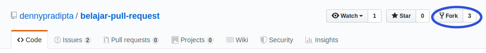
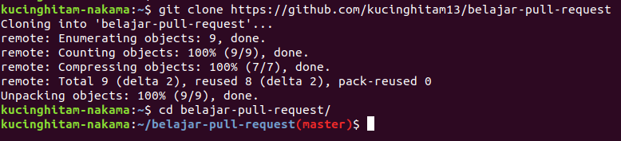
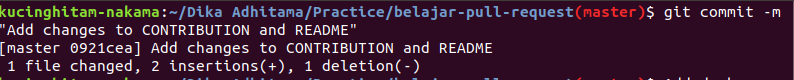
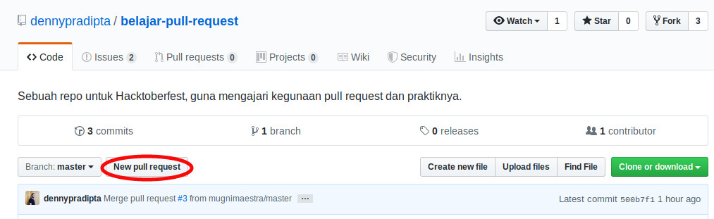
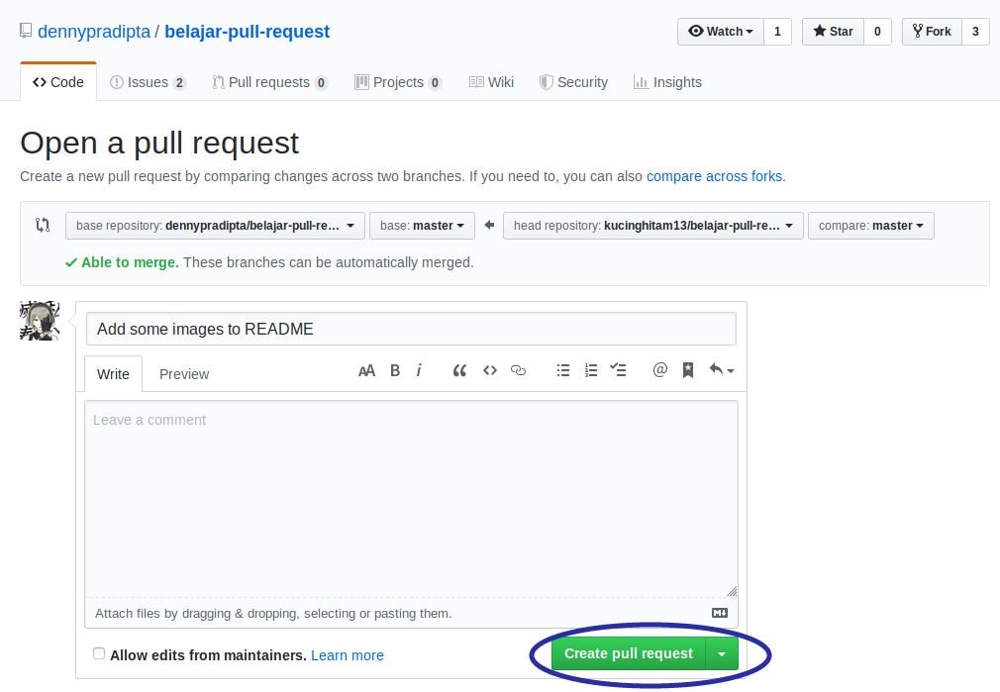

# Belajar Pull Request

## Pembukaan

*Repository* ini adalah repo untuk belajar **Pull Request** bagi para pengembang, untuk dapat mengelola repo dengan banyak kolaborator. Repo ini dibuat karena adanya acara tahunan **Hacktoberfest 2019**. Melalui repo ini, anda akan belajar untuk melakukan **Pull Request** dengan menambahkan nama dan link profil Github anda di file CONTRIBUTORS.md.

## Apa itu **Pull Request**?

Menurut halaman Github di [sini](https://help.github.com/en/articles/about-pull-requests) (Halaman dibuka 27 September 2019), ***Pull Request*** atau **PR** adalah suatu metode untuk memberi tahu yang lain bahwa ada perubahan yang di*push* ke suatu branch di dalam *repository* Github. Ketika **PR** telah dibuka, anda dapat mendiskusikan dan mengulas berbagai perubahan dengan para kolaborator dan menambah *commit-commit* tambahan sebelum perubahanmu di*merge* ke dalam branch utama.

## Apa untungnya buat saya dan kolaborator?

Kita ambil contoh kasus berikut: Anda melihat proyek di Github yang potensial. Namun, ada flow yang sekiranya kurang efektif dan anda mampu membetulkannya. Sayangnya, anda tidak mempunyai akses *write* ke *repository* tersebut, karena anda maupun dia tidak mengenal satu sama lain.

Anda dapat membetulkan flow yang kurang efektif, lalu melakukan **PR** ke pemilik *repository*. Pemilik *repository* kemudian mendapatkan notifikasi ada yang melakukan **PR** ke *repository* miliknya. Ternyata, pemilik *repository* setuju dengan perubahan anda, dan perubahan yang anda **PR** di*merge* ke dalam *repository* miliknya.

Kolaborator senang karena dibantu dengan **PR** anda dan anda juga senang nama anda terpampang di bagian *contributors* mereka (apalagi kalau **PR** ke proyek besar, semakin bangga pasti). *Win-win solution indeed, right?* :)

## Saya ingin berkontribusi, kontribusi apa yang diharapkan?

Kontribusi yang anda lakukan sangat simpel, yaitu menambahkan nama anda dan link profil Github anda di file CONTRIBUTORS.md, lalu melakukan **PR** ke repo ini. Namun, kontribusi yang anda berikan juga dapat berupa bentuk lain, seperti memperbaiki README ini misalnya atau mungkin menambahkan gambar supaya lebih indah dilihat.

## Simpel sekali. Bagaimana cara untuk melakukan **PR**?

**PR** dapat dilakukan dengan mengikuti langkah-langkah sebagai berikut:

- ***Fork*** *repository* ini (klik tombol di pojok kanan atas)

- Setelah proses *fork* selesai, lakukan:
```
# Kode ini dilakukan di terminal Linux atau OSX
# Mungkin ada yang bisa menambahkan untuk Windows?

# Clone repository yang sudah di fork
git clone <link repository yang sudah difork>

# Pindah ke directory belajar-pull-request
cd belajar-pull-request
```

- Ubah file sesuai dengan keperluan anda
- Commit file yang tadi sudah diubah dengan cara
```
git commit . -m 'isi pesan commit'
```


[Writing good commit messages](https://github.com/erlang/otp/wiki/writing-good-commit-messages)
- *Push* ke *repository* anda dengan cara:
```
# Push ke repository anda
git push origin master
```

- Buka halaman *repository* ini, lalu tekan tombol ***Create Pull Request***

- Cek kembali apakah ada *conflict* antara apa yang anda *push* dan yang ada di *repository* sekarang. Apabila ada, anda harus kembali ke terminal dan melakukan ```git pull origin master``` di terminal anda, lalu ***push*** kembali.
- Jika tidak ada *conflict*, tekan tombol ***Create Pull Request***

- Setelah anda melakukan **PR**, **PR** yang anda lakukan akan direview oleh pemilik *repository* yaitu saya. Apabila sesuai, akan saya *merge*.
- **Selesai!**

## Closing

Apabila anda punya pertanyaan, saya akan berusaha menjawab pertanyaan anda di Twitter ([@dennypradipta_](https://www.twitter.com/dennypradipta_)) karena akhir-akhir ini mulai aktif Twitter lagi.

Happy hacking!
